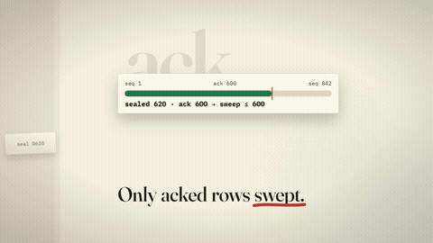
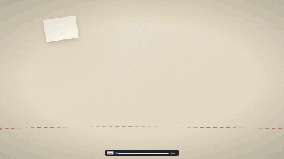
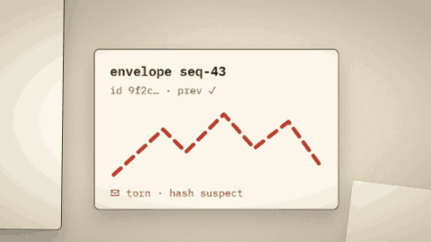

<p align="center">
  
</p>

# fielog — Fieldlog

Write anywhere, settle later.

Offline-first primitives for apps that must survive bank-down, blank-spot,
blackout: append-only log (source of truth) + SQLite read-model + sync-later.

```js
import { createKernel } from 'fielog';

const k = await createKernel({ file: 'kasir.db' });
await k.append({ type: 'bayar', nominal: 5000, oleh: 'kasir-1' });
const rows = await k.query('SELECT SUM(nominal) AS total FROM bayar WHERE voided = 0');
console.log(rows[0].total); // 5000 — IOU_RECORDED, bukan lunas
k.close();
```

Uang offline selalu tercatat sebagai `IOU_RECORDED`; settlement butuh ack
online. `append`/`query`/`undo` tidak pernah menyentuh jaringan — hanya
`sync`.

## Mulai

- [install](docs/install.md) — syarat (`bun` >= 1.0), pasang, file yang lahir
- [quickstart](docs/quickstart.md) — 1 HP offline, 2 HP sync (dev + mode tanda), runnable
- [cli](docs/cli.md) — `serve` / `sync` / `demo`, tiap flag terverifikasi ke `bin/fielog.ts`
- Contoh nyata: `demo/kasir-2hp.ts` (`bun run demo`), `example/kasir.mjs` (`bun example/kasir.mjs`)

## Galeri

| | |
|---|---|
| <br>hash chain — tiap append tersegel ke entri sebelumnya | <br>delta sync — hanya selisih yang terbang, lanjut dari ack terakhir |
| <br>relay — HP buta saling titip pesan via server | <br>snapshot+truncate — pangkas log tanpa hilang jejak |
| <br>capability+revoke — token bertanda, cabut tanpa ampun | <br>quarantine — entri rusak dikurung, bukan dibuang diam-diam |
| <br>read model — SQLite dibangun ulang dari log | <br>soft delete — hapus = nisan, riwayat tetap utuh |

## Konsep & arsitektur

- [architecture](docs/architecture.md) — peta modul log/store/kernel/sync/relay/cas/retain
- [contracts](docs/contracts.md) — janji mengikat: dead-letter, kompensator buta,
  seal<=ack, device.explicit, purge inkremental, jitter deterministik, superset v0.5
- [kernel-api](docs/kernel-api.md) — `createKernel`, `Kernel`, `LogEvent`, `EventStore`
- [sync-protocol](docs/sync-protocol.md) — push/pull, failover, backoff, deltasync
- [relay](docs/relay.md) — `WsRelayServer` + `WsRelayClient`
- [retention](docs/retention.md) — snapshot + truncate
- [auth](docs/auth.md) — device key, grant, token kapabilitas, countersign, revoke

## Subsistem (pendalaman)

- token: [capability-token](docs/capability-token.md) · revoke:
  [revoke-handshake](docs/revoke-handshake.md),
  [revoke-event-log](docs/revoke-event-log.md) — regroup di [auth](docs/auth.md)
- delta-sync: [delta-sync](docs/delta-sync.md) · hash chain:
  [hash-chain-log](docs/hash-chain-log.md) · karantina: [quarantine](docs/quarantine.md)
- lampiran: [cas-store](docs/cas-store.md) · soft-delete:
  [tombstone-engine](docs/tombstone-engine.md) · kuota: [quota-guard](docs/quota-guard.md)
- rig & harness: [multi-device-rig](docs/multi-device-rig.md),
  [corpus-generator](docs/corpus-generator.md),
  [corruption-generator](docs/corruption-generator.md),
  [cold-drill](docs/cold-drill.md), [soak-runner](docs/soak-runner.md),
  [chaos-kill](docs/chaos-kill.md), [flake-hunter](docs/flake-hunter.md),
  [conformance-gate](docs/conformance-gate.md), [watchdog](docs/watchdog.md),
  [mismatch-stop](docs/mismatch-stop.md), [completion-protocol](docs/completion-protocol.md),
  [merge-runner](docs/merge-runner.md), [model-oracle](docs/model-oracle.md),
  [compat-vectors](docs/compat-vectors.md), [decision-log](docs/decision-log.md)

## Angka, batasan, kontribusi

- Benchmark: [bench](docs/bench.md) (terukur 2026-09-05) —
  smoke 2026-09-09: `bun bench/bench-append.ts 200` →
  **314 append/detik, p50 2.94 ms, p99 6.76 ms**.
  Ulang via `bun run bench:append | bench:query | bench:sync`.
- Kompat log: [compat](docs/compat.md) · changelog: [CHANGELOG](CHANGELOG.md)
- Batasan + troubleshooting: [limits-troubleshooting](docs/limits-troubleshooting.md)
- Kontribusi: [CONTRIBUTING](CONTRIBUTING.md) · keamanan: [SECURITY](SECURITY.md) ·
  perilaku: [CODE_OF_CONDUCT](CODE_OF_CONDUCT.md)

CLI serve/sync default mode tanda: serve butuh `--trust <id=pub.pem>`
(ulang per device), sync butuh `--key <priv.pem> --as <device>`.
`--unsigned` relay terbuka hanya untuk dev lokal, bukan produksi.
